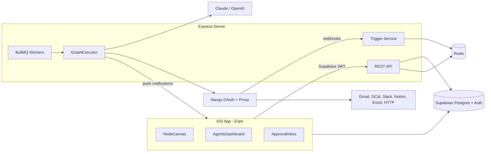

# Agents App: Architecture and Build Plan

## 1. System architecture

The phone is the builder and control panel. The backend is the engine. The app only saves graphs, shows runs, and handles approvals. All triggering and execution happens server-side.



- **Auth:** Supabase Auth (email plus Sign in with Apple). Express verifies the Supabase JWT on every request.
- **Queue:** BullMQ on Redis handles runs, retries, cron schedules and polling. Redis and the server run under `docker compose` locally.
- **Connectors:** Nango handles the OAuth dance through the in-app browser (`expo-web-browser`, which uses `ASWebAuthenticationSession`). It stores tokens, and API calls go through its proxy.
- **Excel:** Microsoft Graph (OneDrive/SharePoint workbooks) through Nango's Microsoft integration.

## 2. Monorepo layout (npm workspaces, TypeScript everywhere)

- [apps/mobile/](apps/mobile/): the Expo app (Expo Router, Reanimated, Gesture Handler, `@shopify/react-native-skia`, `@gorhom/bottom-sheet`, TanStack Query, Zustand)
- [apps/server/](apps/server/): Express API, BullMQ workers, graph executor, node executors
- [packages/shared/](packages/shared/): node type registry (metadata plus zod config schemas), graph schema, shared types. Mobile and server both import it, so config forms and validation never drift apart.
- [supabase/migrations/](supabase/migrations/): SQL schema and RLS policies
- [docker-compose.yml](docker-compose.yml): server, worker and redis

## 3. Database schema (Supabase, RLS on everything keyed by `user_id`)

- `profiles`: id (= auth.users.id), display_name, plan, expo_push_token
- `agents`: id, user_id, name, icon, color, status (`draft|active|paused`), active_version_id, created_at
- `agent_versions`: id, agent_id, version, graph jsonb (`{nodes, edges, viewport}`), created_at. Graphs are immutable once published, so every run points to the exact version it used.
- `connections`: id, user_id, provider (`gmail|gcal|slack|notion|excel`), nango_connection_id, account_label, scopes, access_mode (`read|read_write`)
- `triggers`: id, agent_id, type (`manual|schedule|webhook|gmail_new_email|slack_message|...`), config jsonb, webhook_secret, cursor jsonb (for polling state), enabled
- `runs`: id, agent_id, version_id, trigger_type, status (`queued|running|waiting_approval|succeeded|failed|cancelled`), input jsonb, output jsonb, error, token_usage, started_at, finished_at
- `run_steps`: id, run_id, node_id, status, input jsonb, output jsonb, error, started_at, finished_at. This table drives the run log.
- `approvals`: id, run_id, node_id, action_summary, payload jsonb, status (`pending|approved|rejected`), decided_at
- `templates`: id, name, description, category, graph jsonb, required_providers text[], featured
- `llm_credentials` (optional BYOK): user_id, provider, encrypted_key

## 4. Node system (the core)

Every node type is defined once in [packages/shared/src/nodes/](packages/shared/src/nodes/) and has a matching executor in [apps/server/src/executors/](apps/server/src/executors/).

```ts
// packages/shared/src/nodes/types.ts
export interface NodeDefinition<C = unknown> {
  type: string;                 // "gmail.send"
  category: 'trigger' | 'action' | 'logic' | 'ai';
  label: string; icon: string; color: string;
  provider?: 'gmail' | 'gcal' | 'slack' | 'notion' | 'excel';
  configSchema: z.ZodType<C>;   // drives the auto-generated config form on mobile
  inputs: PortDef[]; outputs: PortDef[];
  sideEffect?: boolean;         // true => eligible for "confirm before running"
  asTool?: { description: string }; // can be exposed to the AI Agent node as a tool
}
```

**MVP node catalog**
- Triggers: Manual, Schedule (cron), Webhook, Gmail New Email, Slack New Message, Notion Database Item Added
- AI: LLM Prompt (single call, structured output), AI Agent (tool-calling loop; any action nodes wired into its "tools" port become tools), Classify/Extract
- Actions: Gmail Send/Reply/Search, GCal Create/List Events, Slack Post Message, Notion Create/Update Page and Query Database, Excel Append Row/Read Range, HTTP Request
- Logic: If/Else, Switch, Delay, Loop over list, Set Variable, Human Approval

**Data passing:** each step's output is stored under `ctx.nodes[nodeId]`. Config fields support template expressions such as `{{nodes.trigger.subject}}`, resolved by a small safe interpreter (no `eval`).

**LLM abstraction:** [apps/server/src/llm/](apps/server/src/llm/) defines an `LLMProvider` interface (`chat({messages, tools, schema})`) with `AnthropicProvider` and `OpenAIProvider` implementations. The AI node config chooses the provider and model.

**Executor:** `GraphExecutor` validates the graph, then walks it from the trigger node in topological order and follows branch outputs. It writes `run_steps` as it goes. When it reaches a Human Approval node (or a `sideEffect` node with confirmation enabled), it creates an `approvals` row, sets the run to `waiting_approval`, sends a push notification, and resumes when the user decides.

## 5. Triggers

- **Schedule:** BullMQ repeatable jobs, registered when an agent is activated.
- **Webhook:** `POST /hooks/:triggerId` with a secret; the payload becomes the run input.
- **Gmail / Notion:** polling jobs every 1-2 minutes using the stored `cursor` (Gmail `historyId`). Gmail Pub/Sub push can come later.
- **Slack:** Slack Events API delivered through Nango webhooks to `POST /nango/webhook`.
- **Manual:** the "Run now" button calls `POST /agents/:id/runs`, and it also powers Test mode.

## 6. Express API surface

- `GET/POST/PATCH/DELETE /agents`, `POST /agents/:id/publish`, `POST /agents/:id/activate|pause`
- `POST /agents/:id/runs` (manual/test; `dryRun` flag stubs side-effect nodes), `GET /runs/:id`
- `POST /approvals/:id/decide`
- `POST /connections/session` (creates a Nango connect session token), `GET/DELETE /connections`
- `GET /templates`, `POST /templates/:id/clone`
- `POST /hooks/:triggerId`, `POST /nango/webhook`
- Middleware: Supabase JWT auth, zod validation, rate limiting

## 7. Mobile app layout (Expo Router)

- **Tabs:** Agents (dashboard), Templates, Activity (all runs plus the approval inbox), Connections, Settings
- **Agents tab:** cards showing status toggle, last run, success rate, and a "Run now" button
- **Builder screen** (`/agents/[id]/builder`):
  - Skia draws the grid and bezier edges; nodes are Reanimated views
  - Pan and pinch-zoom operate on a world transform, and nodes can be dragged
  - To connect nodes, tap an output port and then an input port. On a phone this is more reliable than drag-to-connect; drag-to-connect can be added as well.
  - A bottom-sheet node library (searchable, grouped by category) and a bottom-sheet config form generated from `configSchema`
  - Toolbar with Undo/Redo, Test run, and Publish. Live run highlighting shows which node is currently executing.
- **Run detail:** a timeline of `run_steps` with expandable input and output for each step
- **Connections:** provider list with Connect/Disconnect and a read or read/write toggle
- **Templates:** gallery with a preview and a "Use template" button. The template flow checks for required connections and prompts the user to connect any that are missing.

## 8. Build phases

1. **Foundation:** monorepo, Expo app shell with tabs, Supabase project plus migrations and RLS, Supabase auth on mobile, Express with JWT middleware, docker compose (server, worker, redis)
2. **Engine without integrations:** shared node registry, GraphExecutor, BullMQ run queue, Manual/Schedule/Webhook triggers, LLM Prompt node (Claude plus OpenAI), HTTP and Logic nodes, run logs
3. **Canvas builder:** pan/zoom/drag, edges, node library sheet, auto-generated config forms, save/publish versions, Test run with live highlighting
4. **Connectors through Nango:** Gmail, GCal, Slack, Notion, Excel action nodes, plus Gmail/Slack/Notion triggers
5. **AI Agent node and safety:** tool-calling loop over connected action nodes, Human Approval node, confirm-before-send, push notifications (Expo Notifications), approval inbox, kill switch
6. **Templates and polish:** 6-8 seeded templates (email auto-responder, daily calendar briefing to Slack, Slack-to-Notion notes, form webhook to Excel row), onboarding, empty states

## 9. Environment notes

- The repo is under OneDrive. Syncing `node_modules` is slow and can lock files, so moving the project outside OneDrive (for example `C:\dev\agents`) is recommended.
- Skia and other native modules require an **Expo dev build**, not Expo Go. From Windows, iOS builds go through **EAS Build** (cloud) and install on a physical iPhone. This requires an Apple Developer account.
- Required accounts and keys: Supabase project, Nango (cloud free tier or self-hosted), Anthropic and OpenAI API keys, Google Cloud OAuth app (Gmail/Calendar, which needs Google verification before public launch), Slack app, Notion integration, Microsoft Entra app (Excel).
